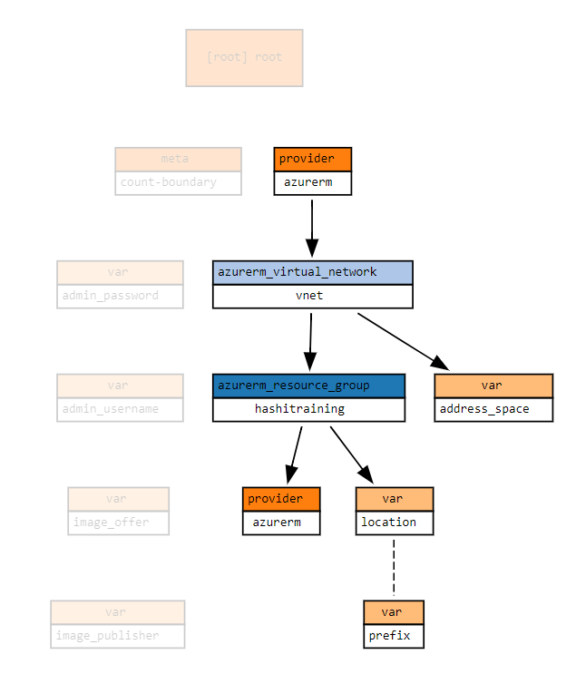
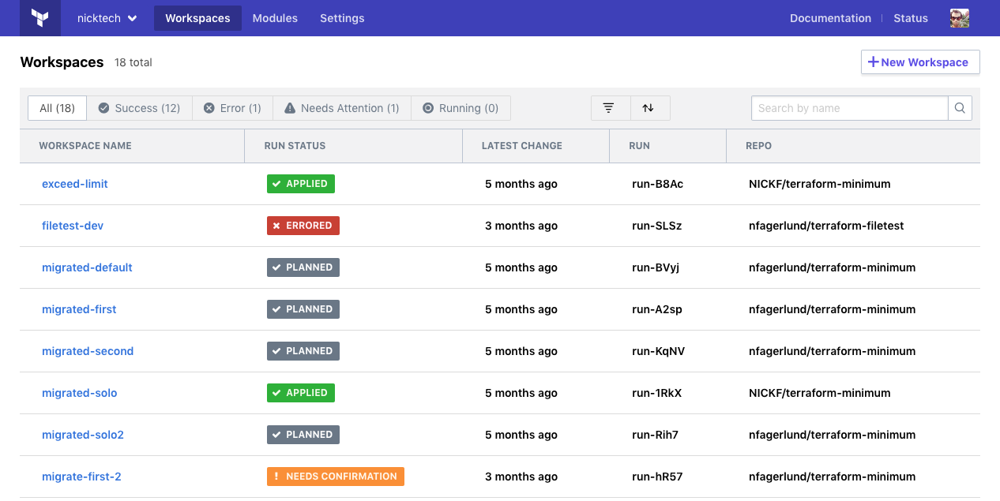
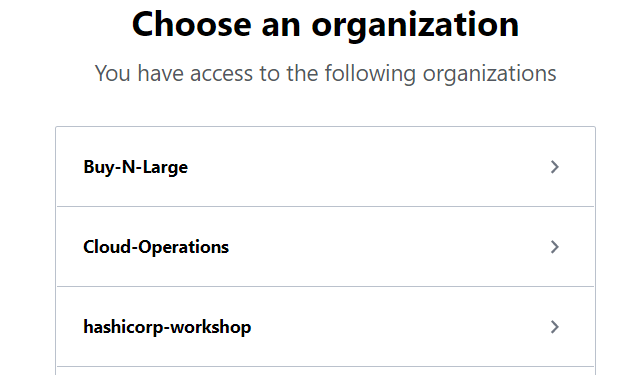
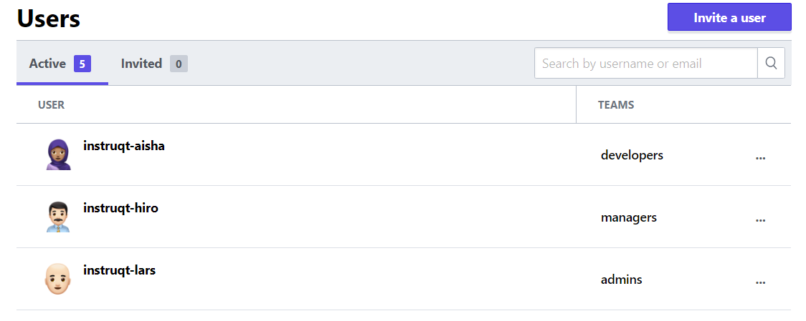

name: VMware-Terraform-Workshop
class: center
count: false

<br><br>
## VMware & Terraform
### Building VMware Resources With Infrastructure as Code
???
HTML comments like this one will show up in the source code, but not in the slides or speaker notes.
--->

The Markdown content is contained in the docs/ subdirectories.

Here are some helpful keyboard shortcuts for the instructor or participant:

⬆ ⬇ ⬅ ➡ - Navigate back and forth
P         - Toggle presenter view
C         - Pop an external window for presentation

Instructor notes are included in plain text, narrative parts are in **bold**. You can use the narrative quotes or change them to suit your own presentation style.

---
layout: true

.footer[
- Copyright © 2021 HashiCorp
- 
]

---
name: Introductions
# Introductions
* Your Name
* Job Title
* Automation Experience
* Favorite Text Editor

???
Use this slide to introduce yourself, give a little bit of your background story, then go around the room and have all your participants introduce themselves.

The favorite text editor question is a good ice breaker, but perhaps more importantly it gives you an immediate gauge of how technical your users are.

**There are no wrong answers to this question. Unless you say Notepad. Friends don't let friends write code in Notepad.**

**If you don't have a favorite text editor, that's okay! Our cloud lab has Visual Studio Code preinstalled. VSC is a free programmer's text editor for Microsoft, and it has great Terraform support. Most of this workshop will be simply copying and pasting code, so if you're not a developer don't fret. Terraform is easy to learn and fun to work with.**

---
name: Table-of-Contents
# Table of Contents

1. What is Terraform<br>
2. What is IAC<br>
3. Why Terraform & VMware<br>
4. Terraform Open Source & The Basics<br>
5. Provision and Configure VMware VMs<br>
6. Manage and Change Infrastructure State<br>
7. Terraform Enterprise/Cloud<br>
8. Security and RBACs<br>
9. Version Control & Policy Enforcement<br>
10. Terraform Modules & API<br>

???
This workshop should take roughly three hours to complete.

---
name: terraform-cloud-what-it-is
# Terraform - ClickOps & DevOps Workflow

.center[
<br>
The end goal of today will be to understand this workflow.
]

???
---
name: intro-to-terraform-demo
class: title
# Chapter 1
## Introduction to Terraform

???
We use the word chapter here, because the training should feel like a story unfolding. The instructor's job is to guide the learners through this interactive story.

---
name: How-to-Provision-a-VM
# How to Provision an VMware VM

Let's look at a few different ways you could provision a new VMware Virtual Machine. Before we start we'll need to gather some basic information including:

* Virtual Machine Name
* Operating System (Image)
* VM Size
* Geographical Location
* Username and Password

???
**How do people get started with VMware? That's right, we log onto a Portal and start clicking around. **


---
name: VMware-Portal-Provision
# Method 1: VMware/VSphere/VCenter UI (GUI)
.center[
  
]

???
**This should look familiar if you've ever used VMware. You click on Virtual Machines, and you'll see a whole list of different base images you can use to provision your VM. Some of these are provided by Microsoft, others are provided by third parties in the marketplace. You either search or browse for the thing you need, and click on it. Easy.**

---
name: VMware-Portal-Provision-2
# Method 1: VRA Portal (GUI)
.center[

]
???
**Once you've chosen your base OS image, you will fill in some more details like the size of the VM, which location you want to run it in, and the initial administrator password. The VMware portal can be handy for spinning up individual VMs and dev or test environments. The good news is it's really easy to spin up infrastructure this way. The bad news is that it doesn't scale, and chances are nobody's keeping track of what got built.**

It's really easy to make a big mess of things if you simply give everyone a portal account and turn them loose in the cloud environment.

---
name: VMware-VRA-Template
class: compact
# Method 2: VRA Template
```bash
name: Blueprint with Comments
formatVersion: 1
version: 1
inputs:
  image:
    type: string
    title: Operating System
    description: Which OS to use
    enum:
      - Ubuntu
      - Windows
```

VRA templates provide a consistent and reliable way to provision VMware resources.

???

---
name: VMware-VRA-Template
class: compact
# Method 3: Powershell or other Script Langauge
```powershell
function handler($context, $payload) {
    $oldVMName = $payload.resourceNames[0]
    $newVMName = $payload.customProperties.userDefinedName
    $returnObj = [PSCustomObject]@{
        resourceNames       = $payload.resourceNames
    }
    $returnObj.resourceNames[0] = $newVMName
    Write-Host "Setting machine name from $($oldVMName) to $($newVMName)"
    return $returnObj
}
```
.center[Can be difficult to read and author for some users.]
???
---
name: Provision-with-Terraform-2
# Method 4: Provision with Terraform
```terraform
resource "vsphere_virtual_machine" "vm" {
  name             = "my-new-vm"
  folder           = "web-servers"
  clone { template_uuid = data.vsphere_virtual_machine.template_from_ovf.id }
  num_cpus = 2
  memory   = 2048
  guest_id = var.vm_guest_id
  disk {
    label = "disk0"
    size  = 20
```
.center[Example terraform code for building an VMware VM.]

???

---
name: What-is-Terraform
# What is Terraform?
```terraform
resource "vsphere_virtual_machine" "vm" {
  name             = "my-new-vm"
  folder           = "web-servers"
  num_cpus         = 2
  memory           = 2048
```
* Executable Documentation
* Human and machine readable
* Easy to learn
* Test, share, re-use, automate
* Works on over 3000 different providers


???

---
name: IaC
# What is Infrastructure as Code?
<br><br><br>
.biglist[
Infrastructure as Code (IaC) is the process of managing and provisioning cloud infrastructure with machine-readable definition files.

**Think of it as executable documentation.**
]

???

---
name: IaC2
# Infrastructure as Code Allows Us To...
???

---
name: IaC2
# Infrastructure as Code with Terraform Allows Us To...
* Provide a codified workflow to create infrastructure
* Change and update existing infrastructure
* Safely test changes using **`terraform plan`** in dry run mode
* Integrate with application code workflows (Git, DevOps tools, Jenkins, Ansible, Chef, Puppet, and other CI/CD tools)
* Provide reusable modules for easy sharing and collaboration
* Enforce security policy and organizational standards
* Enable collaboration between different teams

???
**Now that all your infrastructure is stored in a source code repository, it's very easy for multiple users and teams to collaborate on it. Developer needs a new feature? He or she can easily adjust the source code and send the change back to the operations folks for review. Terraform is a universal language that is understood by both developers and operations teams.**


---
Name: Why-Terraform
# Why Terraform and VMware?
.center[

]

???

---
Name: Why-Terraform-2
# Why Terraform and VMware?


???

---
Name: Why-Terraform-3
# Why Terraform and VMware?
.center[

]

???

---
Name: Why-Terraform-4
# Why Terraform and VMware?
.center[
<br>
]
.center[Terraform VMware Providers]<br>
???

---
name: Chapter-2
class: title
# Chapter 2
## Terraform Basics

???
**Now that you have terraform installed and working with VMware, we can do a few dry runs before building real infrastructure. Follow along carefully, copying and pasting the commands on each slide into your shell as we go.**

---
name: what-is-terraform-oss
class: img-left
# What is Terraform Open Source?


Terraform is an open source provisioning tool.

It ships as a single binary which is written in Go. Terraform is cross platform and can run on Linux, Windows, or MacOS.

Installing terraform is easy. You simply download a zip file, unzip it, and run it.

---
name: terraform-command-line
class: col-2
# Terraform Command Line
Terraform is a command line tool.

Terraform commands are either typed in manually or run automatically from a script.

The commands are the same whether you are on Linux or Windows or MacOS.

Terraform has subcommands that perform different actions.

```terraform
# Basic Terraform Commands
terraform version
terraform help
* terraform init
* terraform plan
* terraform apply
terraform destroy
```

---
name: terraform-code
# Terraform Code
```terraform
resource "vsphere_virtual_machine" "vm" {
  name             = "my-new-vm"
  folder           = "web-servers"
  num_cpus         = 2
  memory           = 2048
```

Terraform code is based on the [HCL2 toolkit](https://github.com/hashicorp/hcl). HCL stands for HashiCorp Configuration Language. Terraform code, or simply *terraform* is a declarative language for provisioning infrastructure on any cloud or platform.

---
name: terraform-workspaces
# Terraform Workspaces

A terraform workspace is simply a folder or directory that contains terraform code.

Terraform files always end in either a `*.tf` or `*.tfvars` extension.

Most terraform workspaces contain a minimum of three files:

**main.tf** - Most of your functional code will go here.<br>
**variables.tf** - This file is for storing variables.<br>
**outputs.tf** - Define what is shown at the end of a terraform run.<br>

---
name: terraform-init
# Terraform Init
```tex
*$ terraform init
Initializing the backend...
Initializing provider plugins...
- Finding latest version of vmware/vra...
- Installing vmware/vra v0.7.1...
- Installed vmware/vra v0.7.1 (signed by a HashiCorp partner, key ID 6B6B0F38607A2264)
--
Terraform has been successfully initialized!
```
Terraform fetches any required providers and modules and stores them in the .terraform directory. If you add, change or update your modules or providers you will need to run init again.

???
**Terraform has an extendible architecture. You download the core program, terraform, then it fetches plugins and modules that are required for your code.**

---
name: terraform-plan
# Terraform Plan
```tex
*$ terraform plan
An execution plan has been generated and is shown below.
Terraform will perform the following actions:
  # vsphere_virtual_machine.name will be created
  + resource "vsphere_virtual_machine" "vm" {
      + id       = (known after apply)
      + location = "vmware-dc-01"
      + name     = "chris-workshop"
      + tags     = (known after apply)
    }
Plan: 1 to add, 0 to change, 0 to destroy.
```
Preview your changes with `terraform plan` before you apply them.

???
**`terraform plan` is a dry run command. We're not actually building anything yet, Terraform is just telling is what it would do if we ran it for real.**

---
name: Chapter-3
class: title
# Chapter 3
## Terraform in Action

???

---
name: anatomy-of-a-resource
# Anatomy of a Resource
Every terraform resource is structured exactly the same way.
```terraform
resource "type" "name" {
  parameter = "foo"
  parameter2 = "bar"
  list = ["one", "two", "three"]
}
```
**resource** = Top level keyword<br>
**type** = Type of resource. Example: `vsphere_virtual_machine`.<br>
**name** = Arbitrary name to refer to this resource. Used internally by terraform. This field *cannot* be a variable.

???
Everything else you want to configure within the resource is going to be sandwiched between the curly braces. These can include strings, lists, and maps.

---
name: provider-block
# Terraform Provider Configuration
The terraform core program requires at least one provider to build anything.
You can manually configure which version(s) of a provider you would like to use. If you leave this option out, Terraform will default to the latest available version of the provider.

```hcl
terraform {
  required_providers {
    vra = {
      source  = "vmware/vra"
    }
  }
  required_version = ">= 0.13"
}
```

---
name: resources-building-blocks
# Resources - Terraform Building Blocks
```hcl
resource "vsphere_virtual_machine" "vm" {
  name     = "${var.prefix}-workshop"
  location = "${var.location}"
}
```

Terraform is easy to work with. You can test your code as you write it.

Simply keep adding more building blocks until your infrastructure is complete.

???
**Try commenting out this code, then uncommenting it. This is the easy way to write code. Just highlight, uncomment, save the file.**

**Resources are the smallest building blocks of Terraform. Think of them as declarative statements about what you want to build. Save the main.tf file.**

**Note that the resource contains references to the two variables we set in the previous chapter, location and prefix. These will be replaced when we run terraform commands. Variables are always enclosed in a dollar sign and curly braces.**

---
name: terraform-apply
class: compact
# Terraform Apply
```tex
*$ terraform apply
An execution plan has been generated and is shown below.

Terraform will perform the following actions:
  # vsphere_virtual_machine.name will be created
  + resource "vsphere_virtual_machine" "vm" {
      + id       = (known after apply)
      + location = "vmware-dc-01"
      + name     = "chris-workshop"
      + tags     = (known after apply)
    }

Plan: 1 to add, 0 to change, 0 to destroy.
```
`terraform apply` runs a plan and then if you approve, it applies the changes.

---
name: terraform-destroy
class: compact
# Terraform Destroy
```tex
*$ terraform destroy
An execution plan has been generated and is shown below.

Terraform will perform the following actions:

  # vsphere_virtual_machine.name will be destroyed
  - resource "vsphere_virtual_machine" "vm" {
      - id       = "14692f20-9428-451b-8298-102ed4e39c2a" -> null
      - location = "vmware-dc-01" -> null
      - name     = "chris-workshop" -> null
      - tags     = {} -> null
    }

Plan: 0 to add, 0 to change, 1 to destroy.
```
`terraform destroy` does the opposite. If you approve, your infrastructure is destroyed.
???
**Terraform can just as easily destroy infrastructure as create it. With great power comes great responsibility!**

---
name: dependency-mapping
class: compact
# Terraform Dependency Mapping
Terraform can automatically keep track of dependencies for you. Look at the two resources below. Note the highlighted line in the vra_deployment resource. This is how we tell one resource to refer to another in terraform.

```terraform
data "vra_project" "this" {
  name = var.project_name
}

resource "vra_deployment" "this" {
  name        = var.deployment_name
  description = "terraform test deployment"
*  project_id  = data.vra_project.this.id
}
```

---
name: tf-dependency-graph
class: img-right
# Terraform Dependency Graph
.center[]

The terraform resource graph visually depicts dependencies between resources.

The location and prefix variables are required to create the resource group, which is in turn required to build the virtual network.

???
This is a good spot to talk a bit about how the dependency graph gets formed.

---
name: Chapter-4
class: title
# Chapter 4
## Provision and Configure VMware VMs

---
name: intro-to-provisioners
# Using Terraform Provisioners
Once you've used Terraform to stand up a virtual machine or container, you may wish to configure your operating system and applications. This is where provisioners come in. Terraform supports several different types of provisioners including: Ansible, Bash, Powershell, Chef, Puppet,  and more.

.center[https://www.terraform.io/docs/provisioners/index.html]

???

---
name: file-provisioner
class: compact
# The File Provisioner
The Terraform file provisioner copies files onto the remote machine.

```terraform
provisioner "file" {
  source      = "files/"
  destination = "/home/${var.admin_username}/"

  connection {
    type     = "ssh"
    user     = "${var.admin_username}"
    password = "${var.admin_password}"
    host     = "${vmwarerm_public_ip.catapp-pip.fqdn}"
  }
}
```

Note the *connection* block of code inside the provisioner block. The file provisioner supports both SSH and WinRM connections.

???
SSH for linux, WinRM for your windows machines.

---
name: local-exec-provisioner
class: compact
# The Local Exec Provisioner
The local exec provisioner allows you to execute scripts or other programs on the local terraform host. If it's something you can run unattended (for example, an Ansible playbook), then you can run it with local exec.

```terraform
provisioner "local-exec" {
  command = "ANSIBLE_HOST_KEY_CHECKING=False ansible-playbook -u {var.user} -i '${self.ipv4_address},' --private-key ${var.ssh_private_key} playbook.yml"
  }
```


???

---
name: remote-exec-provisioner
class: compact
# The Remote Exec Provisioner
The remote exec provisioner allows you to execute scripts or other programs on the target host. If it's something you can run unattended (for example, an Ansible playbook), then you can run it with remote exec.

```terraform
provisioner "remote-exec" {
  inline = [
  provisioner "local-exec" {
    command = "ANSIBLE_HOST_KEY_CHECKING=False ansible-playbook -u {var.user} -i '${self.ipv4_address},' --private-key ${var.ssh_private_key} playbook.yml"
    }
```

???

---
name: puppet-chef-ansible
class: compact
# Terraform & Config Management Tools
.center[]

Terraform works well with common config management tools like Chef, Puppet or Ansible. Below are some links with more information on each:

Terraform and Ansible - Better Together:<br>
https://github.com/scarolan/ansible-terraform

Official Chef Terraform provisioner:<br>
https://www.terraform.io/docs/provisioners/chef.html

Run Puppet with 'local-exec':<br>
https://www.terraform.io/docs/provisioners/local-exec.html

---
name: Chapter-5
class: title
# Chapter 5
## Terraform State

---
name: terraform-state
class: compact, smaller
# Terraform State
Terraform is a _stateful_ application. This means that it keeps track of everything you build inside of a **state file**. The state file is Terraform's source of record for everything it knows about.

```json
{
  "terraform_version": "0.11.13",
  "lineage": "983e6899-96f4-ce60-744e-7123bb1fc315",
  "modules": [
    {
      "path": [
          "root"
      ],
    },
  ],
}
```

---
name: terraform-refresh
# Terraform Refresh
Sometimes infrastructure may be changed outside of Terraform's control.

The state file represents the *last known* state of the infrastructure. If you'd like to check and see if the state file still matches what you built, you can use the **terraform refresh** command.

Note that this does *not* update your infrastructure, it simply updates the state file.

```bash
terraform refresh
```

---
name: change-existing-infra
class: compact
# Changing Existing Infrastructure

Whenever you run a plan or apply, Terraform reconciles three different data sources:

1.  What you wrote in your code
2.  The state file
3.  What actually exists

Terraform does its best to add, delete, change, or replace existing resources based on what is in your *.tf files. Here are the four different things that can happen to each resource during a plan/apply:

```tex
+   create
-   destroy
-/+ replace
~   update in-place
```

---
name: state-quiz
class: compact
# Terraform State Quiz
| Configuration           | State                   | Reality                 | Operation |
| ----------------------- | ----------------------- | ----------------------- |:---------:|
| vsphere_virtual_machine |                         |                         |    ???    |
| vsphere_virtual_machine | vsphere_virtual_machine |                         |    ???    |
| vsphere_virtual_machine | vsphere_virtual_machine | vsphere_virtual_machine |    ???    |
|                         | vsphere_virtual_machine | vsphere_virtual_machine |    ???    |
|                         |                         | vsphere_virtual_machine |    ???    |
|                         | vsphere_virtual_machine |                         |    ???    |

What happens in each scenario? Discuss.

---
name: state-quiz-answers
class: compact
# Terraform State Quiz
| Configuration           | State                   | Reality                 | Operation    |
| ----------------------- | ----------------------- | ----------------------- |:------------:|
| vsphere_virtual_machine |                         |                         | create       |
| vsphere_virtual_machine | vsphere_virtual_machine |                         | create       |
| vsphere_virtual_machine | vsphere_virtual_machine | vsphere_virtual_machine | no-op        |
|                         | vsphere_virtual_machine | vsphere_virtual_machine | delete       |
|                         |                         | vsphere_virtual_machine | no-op        |
|                         | vsphere_virtual_machine |                         | update state |

What happens in each scenario? Discuss.

---
name: Chapter-6
class: title
# Chapter 6
## Terraform Cloud

---
name: terraform-cloud
class: img-right
# What is Terraform Cloud
##### Terraform Cloud is a SaaS and On-Prem application that provides the best workflow for writing and building infrastructure as code with Terraform.


* State storage and management
* Web UI for viewing and approving Terraform runs
* Private module registry
* Version Control System (VCS) integration
* CLI, API or GUI driven actions
* Notifications for run events
* Full HTTP API for automation

---
name: tfcloud-vs-tfe
class: compact
# Terraform Cloud or Terraform Enterprise?
**[Terraform Cloud](https://app.terraform.io/signup)** is a hosted application that provides features like remote state management, API driven runs, policy management and more. Many users prefer a cloud-based SaaS solution because they don't want to maintain the infrastructure to run it.

**[Terraform Cloud for Business](https://www.hashicorp.com/contact-sales/terraform)** utilizes the same hosted environment as Terraform Cloud, but you get the features more applicable to larger teams.  Single Sign-on, Audit Logging, the abbility to use [Agents](https://www.terraform.io/cloud-docs/agents) to deploy in private environments, and integrate with external tools via [Run Tasks](https://www.terraform.io/cloud-docs/integrations/run-tasks).

**[Terraform Enterprise](https://www.hashicorp.com/go/terraform-enterprise)** is the same application, but it runs in your own cloud environment or data center. Some users require more control over the Terraform Cloud application, or wish to run it in restricted networks behind corporate firewalls.

The feature list for these offerings is nearly identical.

---
name: terraform-cloud-remote-state
# Terraform Remote State
By default Terraform stores its state file in the workspace directory on your laptop or workstation. This is ok for development and experimentation, but in a production environment you need to protect and store the state file safely.

Terraform has an option to store and secure your state files remotely. Terraform Cloud accounts now offer unlimited state file storage even for open source users.

All state files are encrypted (using HashiCorp Vault) and stored securely in your Terraform Cloud account. You'll never have to worry about losing or deleting your state file again.

---
name: execution-mode
class: compact
# Terraform Cloud Execution Modes

**Local Execution** - Terraform commands run on your laptop or workstation and all variables are configured locally. Only the terraform state is stored remotely.

**Remote Execution** - Terraform commands are run in a Terraform Cloud container environment. All variables are stored in the remote workspace. Code can be stored in a Version Control System repository. Limited to 1 concurrent run for free tier users.

**Agent Execution** *(Enterprise only)* - Terraform Cloud Agents allow Terraform Cloud and Enterprise to communicate with isolated, private, or on-premises infrastructure. The agent architecture is pull-based, so no inbound connectivity is required. Any agent you provision will poll Terraform Cloud or Enterprise for work and carry out execution of that work locally.

---
name: TFE-Chapter-1
class: title

# Chapter 7
## Terraform OSS, Cloud and Enterprise

???
**In the first chapter we'll cover Terraform open source and some of the differences between OSS and Cloud and Enterprise.**

---
name: terraform-user-journey
# The Terraform User Journey
.center[
<iframe width="560" height="315" src="https://www.youtube.com/embed/FWpCQar9dYg" frameborder="0" allow="accelerometer; autoplay; encrypted-media; gyroscope; picture-in-picture" allowfullscreen></iframe>
]

https://www.hashicorp.com/resources/terraform-adoption-journey

???
**Let's start with a typical Terraform User Journey. Our CTO Armon Dadgar will explain what the stages of Terraform adoption look like.**

If you have a good sound setup, you can simply play Armon's video for your audience. Alternatively you should watch the video and learn how to do this whiteboard talk yourself.

---
name: infrastructure-as-code
class: col-2
# Infrastructure as Code

* Terraform code is written in HCL
* Stop building things by hand
* Put everything into repeatable Terraform configuration
* All build steps are now expressed as code
* If you ever have to rebuild something, it's much easier!


???
**At the core of Terraform is this idea of Infrastructure as Code. Instead of building things as a series of manual steps, or error-prone shell scripts that may or may not be tested and up to date, you express all your infrastructure build steps in this simple Domain Specific Language, or terraform. The official name for the Terraform config syntax is HashiCorp Config Language, or HCL. This language is easy for beginners and powerful for experts. Think of it as the DNA of your infrastructure.**

This slide is here in case you have any brand new, or non-technical people who have never seen a terraform resource before.

---
name: multi-platform-compliance
# Manage All Your Infrastructure
.center[

]

Terraform can run on premise or as a cloud based SaaS with agents.

???

---
name: self-service-infra
# Self-Service Infrastructure

.center[

]

Enable users to build what they need without running up a huge bill or putting your organization at risk.

???
**Terraform Cloud encourages safe provisioning via reusable modules and policy enforcement. Now users can build exactly what they need to do their jobs without breaking things or putting your organization at risk. A slow and cumbersome approval process is no longer required because the automation enforces best practices without manual code reviews.**

---
name: snow-integration
# Terraform Service Now Integration


* Native Service Now Integration
* Service Catalog through VCS
* Approvals in SNOW or Terraform Cloud
* Self-service portal with Terraform on the backend
* Approved Modules with Governance
???


---
name: why-tfc-1
class: img-right
# Terraform Cloud


Terraform Cloud/Enterprise is an application that provides the following features:

???
**Let's go through a quick bullet list of Terraform Cloud features and why they matter.**

---
name: why-tfc-8
class: img-right
# Terraform Cloud


Terraform Cloud/Enterprise is an application that provides the following features:

* UI integration with VCS
* API driven workflows
* Central state management
* Private Module Registry
* Sentinel policy enforcement
* Single Sign-On
* Secure API credentials

???
**Terraform Enterprise can store and encrypt your cloud credentials, passwords or any other sensitive data. These credentials are stored safely inside of a Vault instance that runs inside of TFE.**

---
name: what-is-a-workspace
# Terraform Workspaces
.center[
]

.center[
.small[https://www.terraform.io/docs/cloud/workspaces/]
]


???
**A Terraform workspace is a managed unit of infrastructure. On your laptop or local workstation, the terraform workspace is simply a directory full of terraform code and variables. This code is also ideally stored in a git repository. In the cloud the workspace takes on some extra roles. In Terraform Cloud and Enterprise your workspace is still where you execute terraform runs but there are extra features like access controls, secure variables and policy management. Terraform is only run from secure docker containers that you control. (There is one exception to this and that is when you run terraform locally, but only store the state in Terraform Cloud). Your local workspace, or copy of a git repo, generally maps 1:1 with your terraform workspace.**

**What should I put in a workspace? We recommend infrastructure that should be managed together as a unit be placed into the same workspace. Who has to manage it, how often does it change, does it have external dependencies that we can't control. Ask these questions. Think about what happens when you run `terraform apply`. You should be able to describe what you just built, and what outputs it provides, who this infrastructure is for, and how to utilize it.**

**Terraform forces us to adopt the correct behavior which is to create a contract with our code. The terraform configuration agrees to build X, Y, and Z infrastructure, and to hand off some responsibilities to (Chef|Puppet|Ansible) for application configuration and deployment.**

**A workspace could be: An entire application stack from network on up. Great for dev environments that you want to be completely self-contained. Or it could be a workspace that builds core network infrastructure and nothing else. Maybe the network team has to manage that. They get to be the lords of the network and provide terraform outputs to those who need a VPC or subnet. You can also use workspaces to deploy platform services like Kubernetes. Terraform can even manage IAM policies and roles, so that you can stand up an entire VMware account from scratch using only code. (Which is exactly what you're about to do in the labs...)**

---
name: what-is-an-organization
# Terraform Organizations
.center[
]
.center[
.small[https://www.terraform.io/docs/cloud/users-teams-organizations/organizations.html]
]

???
**Organizations are shared spaces where users become members of teams and collaborate on workspaces. An organization can have hundreds or thousands of workspaces, and multiple teams with different levels of access. Users may belong to multiple organizations and teams.**

---
name: what-is-a-team
# Terraform Teams
.center[
]
.center[
.small[https://www.terraform.io/docs/cloud/users-teams-organizations/teams.html]
]

???
**Teams are groups of users within an organization. Access rights to workspaces are granted at the team level. So for instance you might want to have an admins team, a managers team, and a developers team like you see here.**

---
name: terraform-state
class: title, smokescreen, shelf
background-image: url(images/checklist.jpg)
# Terraform State
## Infrastructure Lifecycle Management

---
name: tf-state-file
# Terraform State
```tex
"location": "vmware-dc-01",
"mac_address": "00-0D-3A-A4-1C-1C",
"name": "hashitest-catapp-nic",
"network_security_group_id": "/subscriptions/14692f20-9428-451b-8298-102ed4e39c2a/resourceGroups/hashitest-workshop/providers/Microsoft.Network/networkSecurityGroups/hashitest-sg",
```

Terraform stores information about the resources it has built in a **state file**. This important file contains all of the data that Terraform needs to change, update, and delete infrastructure.

By default, the state file is stored in your local workspace.

???
**Can anyone tell me why the state file is so important? Have you ever lost your state file? What was that like? I can tell you from experience it's not fun. You have to go and clean up or delete everything you built by hand instead of simply running `terraform destroy`. Recovering from a lost or corrupted state file is possible but painful and time consuming.**

**Also, sometimes sensitive data can leak to the state file. We do our best to prevent this but the safest solution is to encrypt and store the entire state file in a safe place.**

---
name: why-not-local-state
class: img-left-full
# Oops, I Lost My State File


The local state file has some disadvantages:

* Sometimes contains secrets or sensitive data
* Can't collaborate because the file is on someone's laptop
* Risk of losing or deleting the state file
* No centralized record keeping

???
**Let's not be the dog at my homework kid. There's no excuse for losing your state file because you can easily store it for free in your Terraform Cloud account.**

---
name: TFE-Chapter-2
class: title
# Chapter 8
## Security and Role-Based Access Controls

???
**Welcome back, you made it through Chapter 1. Next we're going to look at secure variables and role based access controls or RBACs.**

---
name: securing-sensitive-vars
class: title, smokescreen, shelf
background-image: url(images/secure_lock.jpg)
# Sensitive Variables
## A Secure Place for API Credentials

???
**First let's talk about sensitive variables, specifically API keys. Every time you build infrastructure on VMware you need an access key pair. The key pair includes the Access Key Id, and the Secret Access Key. These two strings paired together, with an optional time-based token, allow you to make requests to VMware API endpoints. Amazon spins up the resources and begins billing you for usage. These keys, especially if they are created by an account admin, are very powerful. The default setting in VMware is to grant admin-level access to the user. Let's look at how this can be a major problem...**

---
name: Security-and-Compliance
# Did you know?
Thousands of API and cryptographic keys are leaked to GitHub every day!

https://nakedsecurity.sophos.com/2019/03/25/thousands-of-coders-are-leaving-their-crown-jewels-exposed-on-github/

>"I think efforts like GitHub’s Token Scanning project should be applauded, but they are only effective once a leak has already occurred. This problem also is likely not isolated to GitHub – it will affect any publicly available code. We need more research to develop systems that help developers avoid this mistake in the first place."

???
**This is from a recent article about a study Sophos did on credentials stored on GitHub. They used a free API key and simple search algorithm to crawl through github and what they found was very disturbing. Hundreds of thousands of API keys, passwords and other sensitive strings were found.**

**If you've never seen it in action this is what usually happens. The attacker takes control of your VMware account and begins spinning up an enormous cryptocurrency farm with the maximum number of instances allowed. Then you have to get VMware support to help you untangle the mess. It's not fun. You really, really want to protect those API keys.**

---
name: Protecting-Sensitive-Variables
class: img-right-full
# Protecting Sensitive Variables


* Cloud API Keys
* Passwords
* SSH private keys
* SSL certificates
* Any sensitive text or data

???
**Terraform Cloud has built in support for encryption and storage of any short string of text. This allows you to safely use these credentials during the provisioning process without exposing them in plaintext or storing them on someone's laptop.**

---
name: a-better-way-creds
# A Better Way to Store Sensitive Data

Terraform Cloud can safely store your credentials and encrypt them for you. You can use this encrypted storage for passwords, TLS Certificates, SSH keys or anything else that should not be lying around in plain text.

.center[]

???
**Here's an example of storing VMware credentials safely so that we can use them inside of a workspace. The user doesn't have to manage these once they are set.**

---
name: TFE-Chapter-4
class: title
# Chapter 10
## Terraform Modules

???
**This is the final content chapter where we'll cover the private module registry and API automation.**

---
name: private-module-registry
class: title, smokescreen, shelf
background-image: url(images/lego_wallpaper.jpg)
# Terraform Modules
## Reusable Infrastructure as Code

???
**First let's take a look at modules. Modules are fun, like these LEGO bricks.**

---
name: what-even-is-module
# What is a Terraform Module?
.center[
]

???

---
name: how-modules-configured
# How are Terraform Modules Configured?
Creating Terraform Modules in 3 easy steps:

1. Write some Terraform code, configuring inputs and outputs.
2. Store the Terraform code somewhere your workstation can access it.
3. Reference your modules by file path or source URL.

Sounds easy right?

What if you had to manage dozens or hundreds of modules, with different versions of each?

???
**Think of a terraform module like a black box. Variables (inputs) go in one side, and outputs come out the other side. What happens in the middle is really none of the user's business, as long as they get what they wanted from the module. This lets you control what users are able to build, and guide them to the right path by putting guard rails around them. You can hide variables and settings that the user should not tinker with, and this also keeps things simpler for the end user who just wants their VPC to work so they can build some instances.**

**The challenge is when you start having dozens or hundreds of modules and lots of users consuming them...you really need a centralized way to manage this stuff, which brings us to...**

---
name: private-module-registry
class: img-right
# Private Module Registry


Terraform modules are reusable packages of Terraform code that you can use to build your infrastructure.

Terraform Cloud includes a Private Module Registry where you can store, version, and distribute modules to your organizations and teams.

???
**This is just like the public module registry but it runs inside your own Terraform Organization where only your users can access it. This way you can share private or confidential code, or even take the public modules and fork them for your own use.**

---
name: api-driven-workflows
class: title, smokescreen, shelf
background-image: url(images/enter_the_matrix.jpg)
---
name: TFE-Chapter-3
class: title

# Chapter 9
## Version Control and Sentinel Policies

???
**Now we're getting into slightly more advanced territory. It is also very cool territory because you can start to drive automation with code. We're going to cover VCS integration and Sentinel policies. The reason we cover VCS before Sentinel is because you'll want to define all your policy as code too!**

---
name: version-control-title
class: title, smokescreen, shelf
background-image: url(images/git_log.png)
# Terraform With VCS
## Version Control Systems

???
**Version control systems have been around for at least a few decades. Can anyone name a few?**

Common answers might be RCS, SVN (Subversion).

**And what's the world's most popular distributed version control system? That's right, it's git. Git was invented by Linus Torvalds, the same gent who created Linux.**

---
name: whats-a-vcs
class: img-right
# What is a Version Control System (VCS)?


Version control systems are applications that allow users to store, track, test, and collaborate on changes to their infrastructure and applications.

Terraform Cloud integrates with most common Version Control Systems.

???
**Make sure you don't confuse git (the version control system) with GitHub (a web-based application containing the world's largest collection of git repositories). What are some other flavors of git? Bitbucket, GitLab are both also supported in Terraform Cloud. Today you'll be working with GitHub but you can integrate with any of the major git vendor software.**

---
name: tfc-infra-as-code-workflow
class: img-left
# VCS Integration with Terraform Cloud


Terraform Cloud can directly integrate with source code repos in GitHub Enterprise, Gitlab, and Bitbucket. This allows you to build simple DevOps workflows with code reviews, testing and approvals.

https://xkcd.com/1597/


???
**If you've never used git before, don't worry. We are only going to be using four or five basic commands. And as our friends at XKCD have pointed out, you can always wipe everything clean and clone a fresh copy of the code.**

---
name: multi-user-collaboration
class: img-right-full
# User Collaboration

Users from different teams or departments can all benefit from centralized infrastructure as code.

Infrastructure changes are no longer created in isolated silos.

Each team can contribute or consume Terraform code according to their needs.

.small[http://www.commitstrip.com/en/2015/02/02/is-your-company-ready-for-devops/]

???
**When you store all your terraform code in git repos, you unlock some extra features like user collaboration. This is a funny comic called CommitStrip where dev and ops try to learn to work together. Terraform Cloud helps bring these teams closer in a more productive way.**

---
name: vcs-driven-workflow
# Automated Test Pipelines
.center[]

When your Terraform code is stored in a version control system, you unlock extra features like pull requests, code reviews and testing. Here's an example showing some tests that run on our training lab repo.

???
**Storing your code in VCS also enables you to build automated test pipelines and conduct code reviews to approve any pending changes. Multiple users can build and contribute changes to the same infrastructure as code base without stepping on one another's toes.**

---
name: everything-is-recorded
# No More Untracked Changes
.center[]

Every infrastructure change is recorded and tracked in the git log. You will always know exactly who made a change, what was changed, who approved the change, and when and why the change was made.

???
**Your auditors and security folks will like this because every change is tracked. No more mystery changes or wondering if something broke because of an untracked change.**

---
name: sentinel-policy-enforcement
class: title, smokescreen, shelf
background-image: url(images/security_lasers.jpg)
# Sentinel
## Policy Enforcement for Terraform

???
**Sentinel is the HashiCorp policy enforcement language and it is only available in terraform cloud or enterprise.**

---
name: what-is-sentinel
# What is Sentinel?
```hcl
# Restricting region in VMware
vmware_location_valid = rule {
  all location_values as rv {
	rv == "vmware-dc-01"
  }
}
```

Sentinel is HashiCorp's policy enforcement language. Sentinel policies are checked after **`terraform plan`** is run. Sentinel will intercept bad configurations *before* they go to production, not after.

???
**As the saying goes, an ounce of prevention is worth a pound of cure. Sentinel helps you catch misconfigurations and bad behavior before the infrastructure is deployed, not after.**

---
name: what-can-sentinel-do
# Example Uses for Sentinel
* Restrict VM images
* Restrict the size of VMware VMs
* Enforce limits on AKS clusters
* And many more!

You can implement these rules and many more using Sentinel.

???
**Sentinel is flexible and can be used to detect almost any kind of compliance or security violation.**

---
name: sentinel-enforcement-levels
# Sentinel Enforcement Levels
⏰ **Advisory** - Issues a warning to the user when they trigger a plan that violates the policy.

⚠️ **Soft-Mandatory** - Blocks regular users from deploying the non-compliant infrastructure. Only admins can override.

🛑 **Hard-Mandatory** - Blocks all users and apps from deploying the non-compliant infrastructure.

???
**There are three enforcement levels. You might start with everything set to Advisory to give your users a warning. Then you could set a date to start enforcing soft and hard mandatory rules for some or all workspaces in your organization.**

---
name: org-or-workspace
# Apply to Organization or Workspaces
.center[]

???
**You can be very specific or very broad with your policy enforcement. Organization-wide policies can be implemented to ensure that basic security rules are always followed everywhere.**


# Terraform Cloud API
## Automate Everything

???
**This section will give us a small sample of what's possible using the Terraform Cloud API to build automation. APIs provide a clear and well understood method for interacting with Terraform Cloud, even from systems that have no native Terraform support or integrations.**

---
name: whats-an-api
# Application Programming Interface
```ruby
curl -s -H "Accept: application/json" https://icanhazdadjoke.com

{
  "id": "jyPCYTKuskb",
  "joke": "How did Darth Vader know what Luke was getting for
           Christmas? He felt his presents.",
  "status": 200
}
```
APIs are the default language of the Internet. According to Akamai research 83% of Internet traffic is made up of API calls (JSON/XML).
.center[.small[https://www.akamai.com/us/en/about/news/press/2019-press/state-of-the-internet-security-retail-attacks-and-api-traffic.jsp]]

???
**There are APIs for all kinds of stuff! Even Dad Jokes!**

---
name: terraform-cloud-api
# Terraform Cloud API - How It Works
```bash
# Create a workspace using the API
curl --header "Authorization: Bearer $TOKEN" --header \
"Content-Type: application/vnd.api+json" --request POST \
--data @/tmp/create_workspace.json \
https://app.terraform.io/api/v2/organizations/$ORG/workspaces
```

1. Applications and tools authenticate to the API with a token.
2. JSON payloads determine which knobs and buttons to push.
3. The JSON payloads are submitted to different API endpoints depending on what you're doing.

Most programming languages have helper libraries for working with APIs.

???
**During the lab we'll be using the Unix cURL command. Curl is like a swiss army knife for talking to APIs and websites.**

---
name: api-use-cases
# Terraform Cloud API - Use Cases

* Continuous Integration test pipelines
* Connect with workflow management systems
* External systems that need to query Terraform state for data
* Self-service portal with Terraform on the backend
* Custom command line scripts for specific needs

???
**Here are just a few of the things you might build with the Terraform Cloud API.**


---
name: terraform-cloud-what-is-it
# Terraform Cloud - ClickOps & DevOps Workflow

.center[

]

???

---
name: additional-resources
class: compact
# Additional Resources
HashiCorp Learning Portal<br>
https://learn.hashicorp.com/terraform/

Microsoft Terraform Quickstarts<br>
https://docs.microsoft.com/en-us/vmware/terraform/

Terraform with VMware Cloudshell<br>
https://docs.microsoft.com/en-us/vmware/terraform/terraform-cloud-shell

Terraform VMwarerm Provider Documentation<br>
https://registry.terraform.io/providers/hashicorp/vmwarerm/latest/docs/

Link to this Slide Deck<br>
https://git.io/JeuCI
